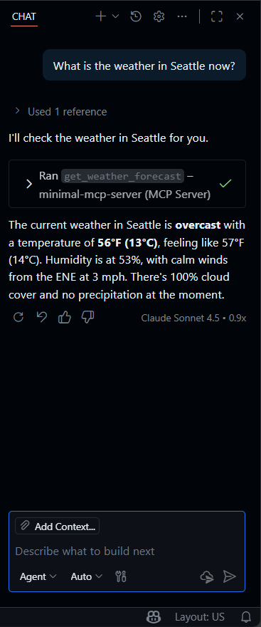

# MCP Learning

A learning repository demonstrating the implementation of **Model Context Protocol (MCP)** servers in C# using the `ModelContextProtocol` NuGet packages. This repository contains examples of both HTTP and STDIO transport implementations.

## 📋 Overview

This repository showcases two different MCP server implementations:

1. **MinimalMcpHttpServer.cs** - An HTTP-based MCP server using ASP.NET Core
2. **MinimalMcpStdioServer.cs** - A STDIO-based MCP server using Microsoft.Extensions.Hosting

## 🚀 Features

Both servers implement the same MCP functionality with different transport mechanisms:

### Common Features
- **Tools**: Executable functions exposed to MCP clients
  - `GetWeatherForecast` - Fetches weather forecast in JSON format from wttr.in API
- **Prompts**: Pre-defined prompt templates
  - `WeatherForecastPrompt` - Template for weather forecast queries
- **Resources**: Static data or configuration values
  - `DefaultCity` - Returns "San Francisco" as the default city

### HTTP Server (`MinimalMcpHttpServer.cs`)
- Built with ASP.NET Core Web API
- Uses `ModelContextProtocol.AspNetCore` package (v0.4.0-preview.3)
- Exposes MCP endpoints via HTTP on `http://localhost:5000`
- Uses `IHttpClientFactory` for HTTP requests (best practice)
- Suitable for remote access and web-based integrations

### STDIO Server (`MinimalMcpStdioServer.cs`)
- Built with Microsoft.Extensions.Hosting
- Uses `ModelContextProtocol` package (v0.4.0-preview.3)
- Communicates via standard input/output streams
- Includes console logging to stderr
- Ideal for local integrations with VS Code and CLI tools

## 📦 Requirements

- .NET SDK (compatible with .NET 10.0-rc.2 or later)
- VS Code

## 🛠️ Usage

### Running the HTTP Server

```powershell
dotnet run MinimalMcpHttpServer.cs
```

The server will start on `http://localhost:5000` and expose the MCP endpoints.

### Running the STDIO Server

```powershell
dotnet run MinimalMcpStdioServer.cs
```

### Integrating with VS Code

The STDIO server can be configured in VS Code using the `.vscode/mcp.json` configuration file:

```jsonc
{
  "servers": {
    "minimal-mcp-server": {
      "type": "stdio",
      "command": "dotnet",
      "args": ["run", "./MinimalMcpStdioServer.cs"]
    }
  }
}
```

Once configured, GitHub Copilot in VS Code can discover and use the exposed tools.

## 📝 How it works



## 📚 Key Concepts

### MCP Components

1. **Tools** - Functions that can be invoked by MCP clients
   - Decorated with `[McpServerTool]` attribute
   - Class marked with `[McpServerToolType]` attribute
   - Support dependency injection
   - Include descriptions for AI assistants

2. **Prompts** - Reusable prompt templates
   - Decorated with `[McpServerPrompt]` attribute
   - Class marked with `[McpServerPromptType]` attribute
   - Provide structured prompts with parameters

3. **Resources** - Static or dynamic data exposed to clients
   - Decorated with `[McpServerResource]` attribute
   - Class marked with `[McpServerResourceType]` attribute
   - Use URI templates for addressing

### Transport Types

- **HTTP Transport** (`WithHttpTransport()`)
  - RESTful API approach
  - Suitable for distributed systems
  - Accessible via HTTP endpoints
  
- **STDIO Transport** (`WithStdioServerTransport()`)
  - Standard input/output communication
  - Perfect for local process integration
  - Used by VS Code, CLI tools, and desktop applications

### Architecture

Both implementations use:
- **.NET Minimal Hosting Model** - Simplified application setup
- **Dependency Injection** - For services like logging and HTTP clients
- **Attributes-based Configuration** - Clean, declarative API definition
- **Async/Await** - Non-blocking operations

## 🔧 Configuration

The repository includes:
- `.vscode/mcp.json` - VS Code MCP server configuration
- `.devcontainer/` - Development container configuration (if using Dev Containers)

## 🤝 Contributing

This is a learning repository. Feel free to experiment with:
- Adding new tools (e.g., file operations, data processing)
- Implementing additional prompts and resources
- Exploring different transport mechanisms
- Adding authentication and authorization
- Integrating with other AI assistants and tools

## 📖 Resources

- [Model Context Protocol Documentation](https://modelcontextprotocol.io/)
- [ModelContextProtocol NuGet Package](https://www.nuget.org/packages/ModelContextProtocol)
- [ModelContextProtocol.AspNetCore NuGet Package](https://www.nuget.org/packages/ModelContextProtocol.AspNetCore)
- [GitHub Copilot MCP Integration](https://code.visualstudio.com/docs/copilot/)